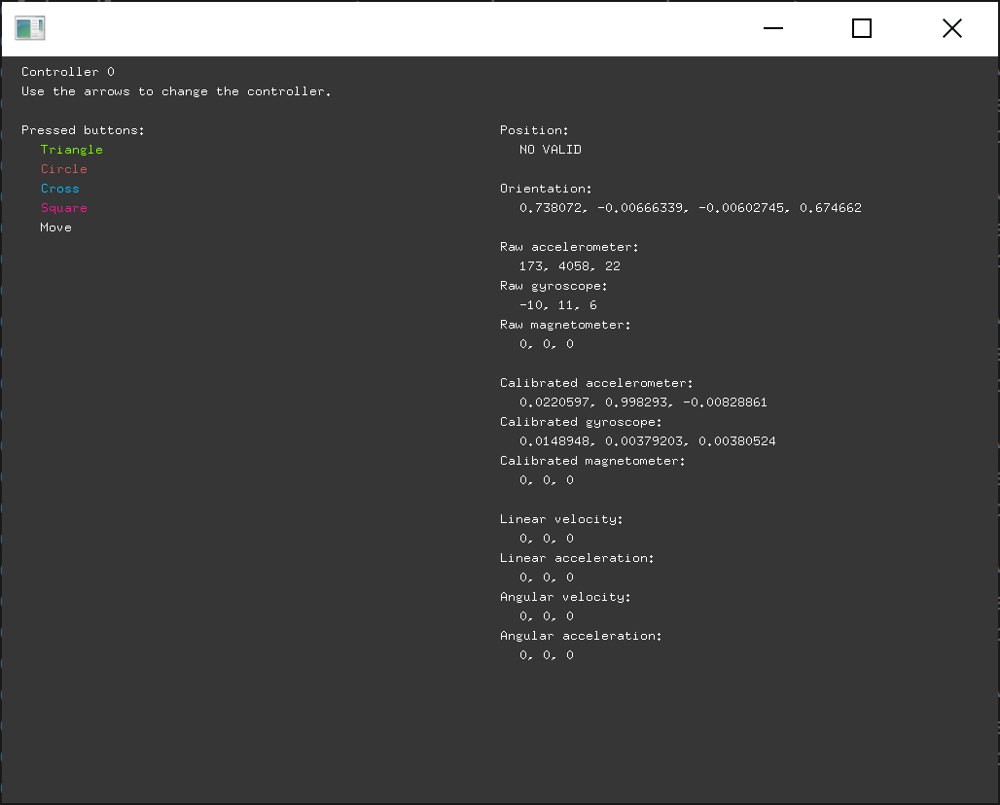
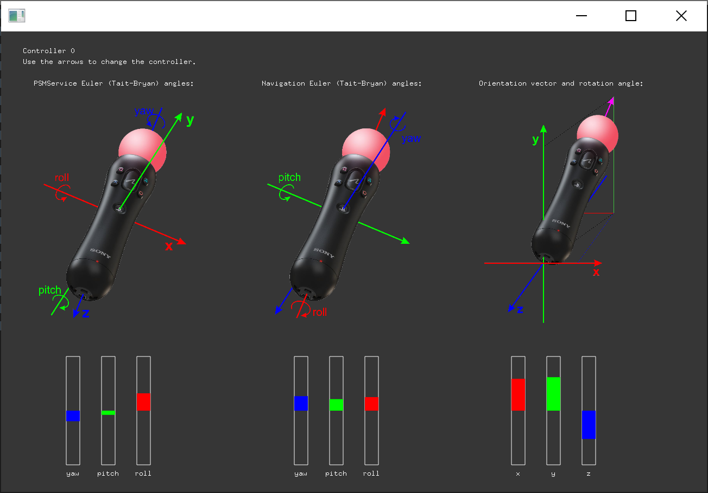

# ofxPSMoveService (BETA)
PSMoveService client to use PSMove controllers in openFrameworks apps

In order to use it, you need to have a PSMoveService running with the controllers paired. It can be in the computer that is running the OF app or in another one in the same network.

The addon is still in beta stage, **it works only on Windows systems and compiled for x64 platform**. I haven't written a nice documentation yet, but you can find the list of the public functions in [ofxPSMoveService.h](https://github.com/DavidDiazGuerra/ofxPSMoveService/blob/master/src/ofxPSMoveService.h), I think their names are obvious enough. It allows you to read the information about the state of the PSMove controllers connected to the PSMoveService, including their position if you have trackers running with your server, and modify the color of their LEDs and make them rumble.

## example
The example included with the addon should show the status of the controller as in the following image:

If you have several controllers, you can select which one you want to see in the screen with the arrow keys. The position information will be "NO VALID" if you don't have trackers or they aren't properly calibrated, but will work fine if you have them. I couldn't get the linear and angular velocity and acceleration yet.

In addition, if you press the Move button of your controller its LED should turn white, the trigger should activate (and regulate) the rumbling, and pressing the SELECT button should reset the orientation to the "identity" pose (pointing down the -Z axis).

## example-orientation
The example-orientation included with the addon should show the orientation of the controller using different as in the following image:

PSMoveService provides the orientation information as a quaternion using the same coordinate system used for the position information. ofxPSMoveService can transform this quaternion to the 3 alternative representations shown in this example:

 - `get_orientationAngles` provides the Euler (Tait-Bryan) angles using the same reference system as PSMoveService, which I found quite inconvenient to use with openFrameworks since rotations about the longitudinal axis affect the three angles.
 - `get_navigationAngles` provides the Euler (Tait-Bryan) angles using a reference system similar to the one used in most navigation systems. I think these angles are easier to use, for example, to control the position of a pointer in the screen.
 - `get_orientationVector` provides a unitary vector pointing in the same direction as the controller using the same reference system as PSMoveService. Knowing the position of the screen, and with the position of the controller provided by `get_position`, it should be possible to get the pixel the controller is pointing to.

As in the previous example, you can select which controller you want to see in the screen with the arrow keys and pressing the SELECT button of the controller should reset the orientation to the "identity" pose (pointing down the -Z axis).
